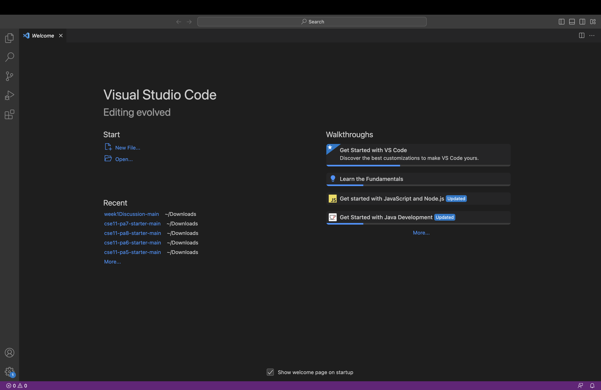
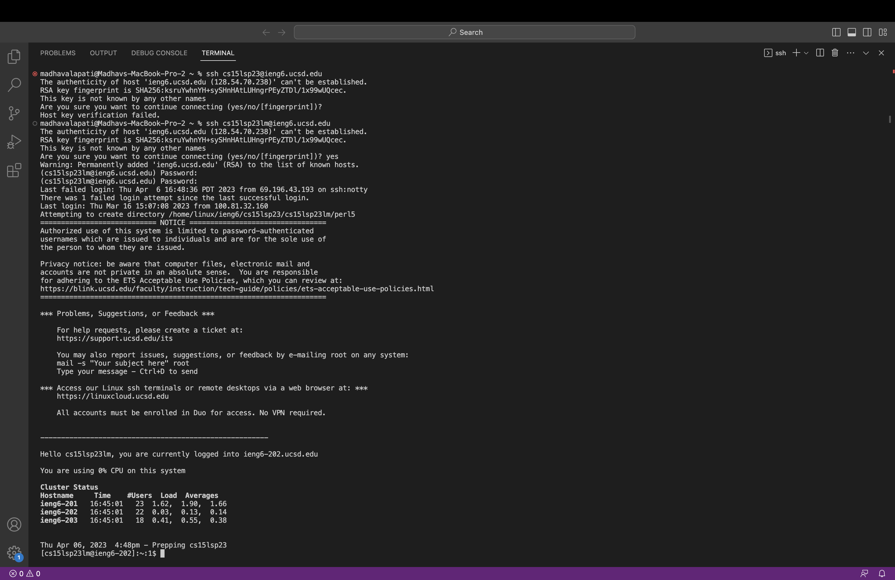
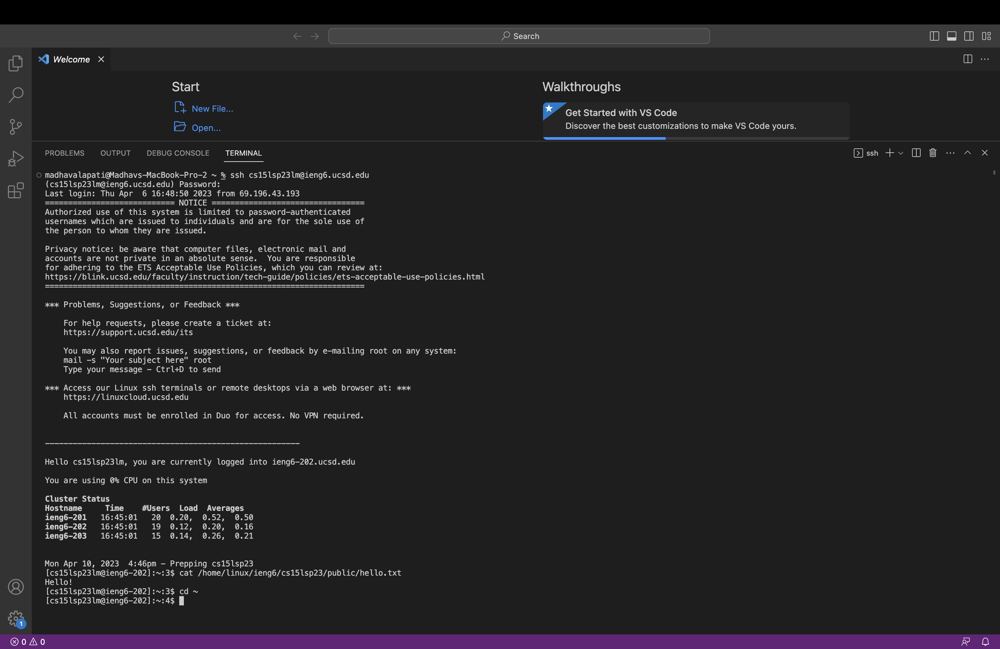

<h1>LAB REPORT 1</h1>

<h2>Installing VScode</h2>

First visit [https://code.visualstudio.com/](https://code.visualstudio.com/) in order to install VSCode. I personally did not have to go through this step as my Mac computer already had VSCode installed.
The image above should be the home page and what pops up after installation and correctly opening VScode.

<h2>Remotely Connecting</h2>

After correctly attaining your password and username for your account at [https://sdacs.ucsd.edu/~icc/index.php](https://sdacs.ucsd.edu/~icc/index.php) for the class you are doing this for. Open up a new terminal by clicking on the terminal button on the top left and then click "New Terminal".
Then type "ssh " followed your course number semester and two given initals and then "@ieng6.ucsd.edu" for example mine was "cs15lsp23lm@ieng6.ucsd.edu". 
So to remotely connect I would enter `ssh cs15lsp23lm@ieng6.ucsd.edu` followed by (yes)  and then enter my password. This is shown in the image above. When typing you password it will not appear and that is okay! It is a security measure.

<h2>Trying Some Commands</h2>

Using "cd, ls, pwd, cp, and e.t.c" we can run different commands and access different files through our account. As seen in the picture above I run this comment
"[cs15lsp23lm@ieng6-202]:~:2$ cat /home/linux/ieng6/cs15lsp23/public/hello.txt"

It returns the output:
"Hello!"

The following command accessed the hello.txt in the cs15lsp23 folder and returned the contents of the file. Like this there are plently of comments you can run and files you can reach with this.
