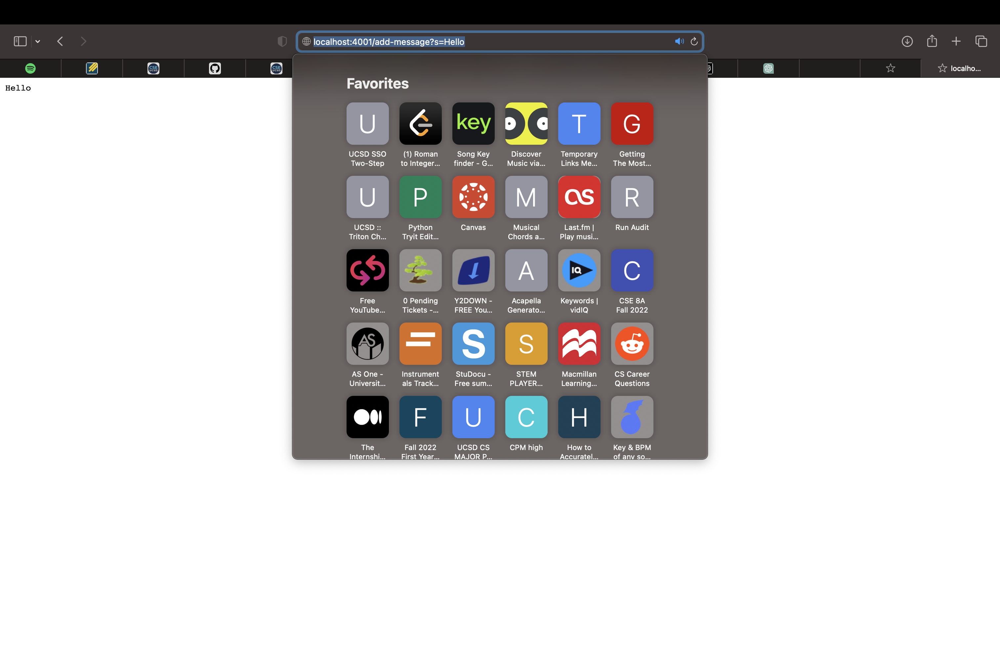
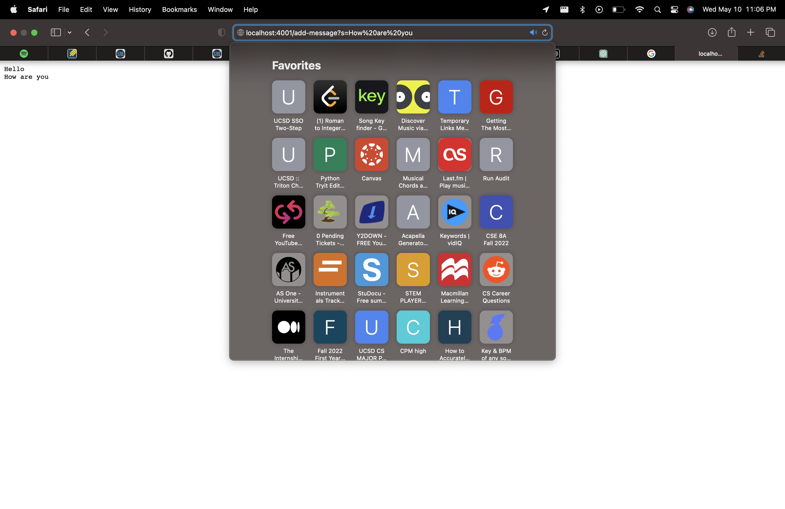
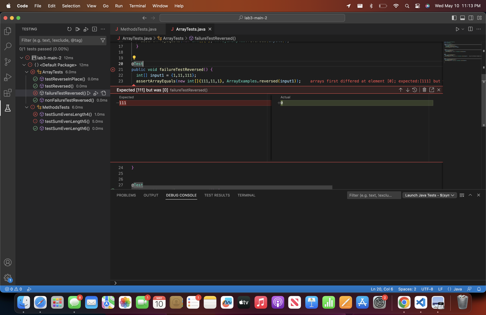
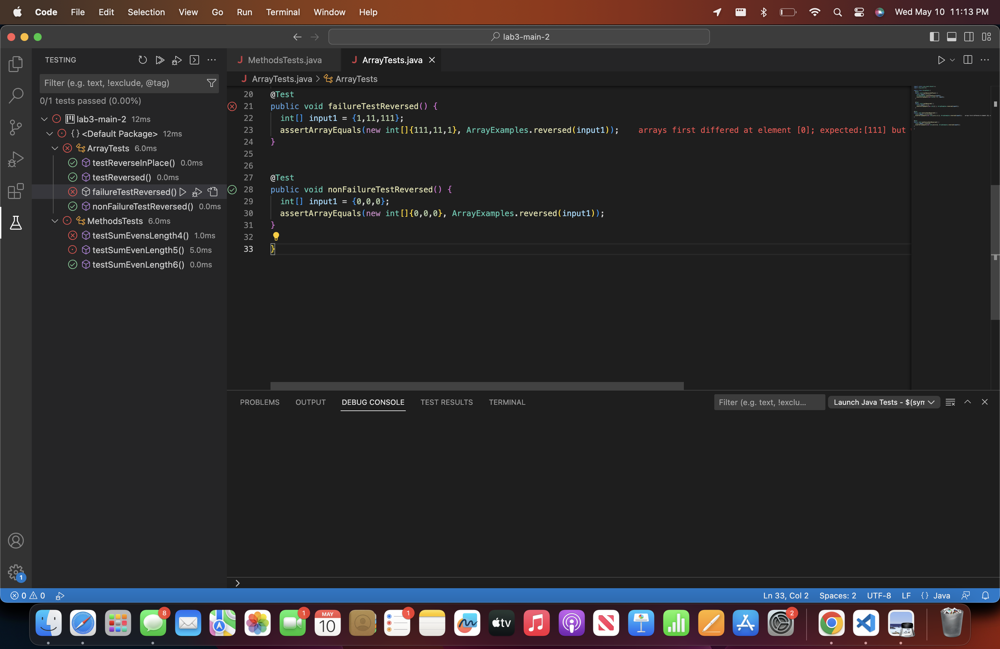

<h1>LAB REPORT 2</h1>
<h2>Part 1: StringServer</h2>
<h3>StringServer Code</h3>

```
import java.io.IOException;
import java.net.URI;

class Handler implements URLHandler {
    // The one bit of state on the server: a number that will be manipulated by
    // various requests.
    StringBuilder sbuild = new StringBuilder();

    public String handleRequest(URI url) {
        if (url.getPath().equals("/")) {
            return sbuild.toString();
        } 
        else {
            System.out.println("Path: " + url.getPath());
            if (url.getPath().contains("/add-message")) {
                String[] parameters = url.getQuery().split("=");
                if (parameters[0].equals("s")) {
                    sbuild.append(parameters[1]).append("\n");
                    return sbuild.toString();
                }
            }
            return "404 Not Found!";
        }
    }
}

    class StringServer {
    public static void main(String[] args) throws IOException {
        if(args.length == 0){
            System.out.println("Missing port number! Try any number between 1024 to 49151");
            return;
        }

        int port = Integer.parseInt(args[0]);

        Server.start(port, new Handler());
    }
}
```

<h3>Step 1 Screenshot</h3>




In the screenshot above (Step 1), there is a server request which calls the method `handleRequest` from the `Handler` class. When you use the arguments and field values of `localhost:4001` and `/add-message?s=Hello` together, it's like sending a special request to the server. This request asks the server to add the word "Hello" to a specific place. The `localhost:4001` part tells the server where to send the request. And the `/add-message` part is the server's way of knowing that it should handle the request to add a message. Lastly, the `?s=Hello` part carries the important information, which is the word "Hello" that you want to be added by the server. In the handler class implementation, the `StringBuilder` field called `sbuild` is the only field that affects the server output. When the `Handler` class is called, it adds the string given to `sbuild`  ("Hello") with a `\n` after and this is how it modifies the server output.

<h3>Step 2 Screenshot</h3>




In the screenshot above (Step 2), there is another server request which calls the method `handleRequest` from the `Handler` class. When you use the arguments and field values of `localhost:4001` and `/add-message?s=How%20are%20you` together, it requests the server to add the phrase "How are you" to the output. The `%20` is used to bridge the spaces between the "How are you" and inform the server that there should be a space. Again, the `localhost:4001` part tells the server where to send the request. And the `/add-message` part is the server's way of knowing that it should handle the request to add a message. Lastly, the `?s=How%20are%20you` part carries the output information, which is the phrase "How are you". In the handler class implementation, the `StringBuilder` field called `sbuild` affects the server output. When the `Handler` class is called, it adds the string given to `sbuild` ("How are you") with a `\n` after.


<h2>Part 2: Lab 3 Bug</h2>
<h3>Failure Inducing Input</h3>


```
@Test
public void failureTestReversed() {
     int[] input1 = {1,11,111};
     assertArrayEquals(new int[]{111,11,1}, ArrayExamples.reversed(input1));
}
```

<h4>Failure Symptom</h4>



<h3>Non-Failure Inducing Input</h3>


```
@Test
public void nonFailureTestReversed() {
     int[] input1 = {0,0,0};
     assertArrayEquals(new int[]{0,0,0}, ArrayExamples.reversed(input1));
}
```


<h4>Non-Failure Symptom</h4>



<h3>The Bug</h3>
<h4>Before</h4>
<h4>After</h4>
<h4>Explanation</h4>

<h2>Part 3: What I Learned</h2>

During the second week of CSE15L lab, I learned something interesting relating to port access. It was not allowed for multiple users on the same computer to uuse the same port simultaneously. When connected to a server, ports serve as channels through which computers transmit internet and network messages. Thus, if multiple students were using an ieng6-201 computer, they would need to select different port numbers of their respective web servers for things to operate properly. This also happened to me when trying to call the same port in `java StringServer 4000` multiple times for example.
