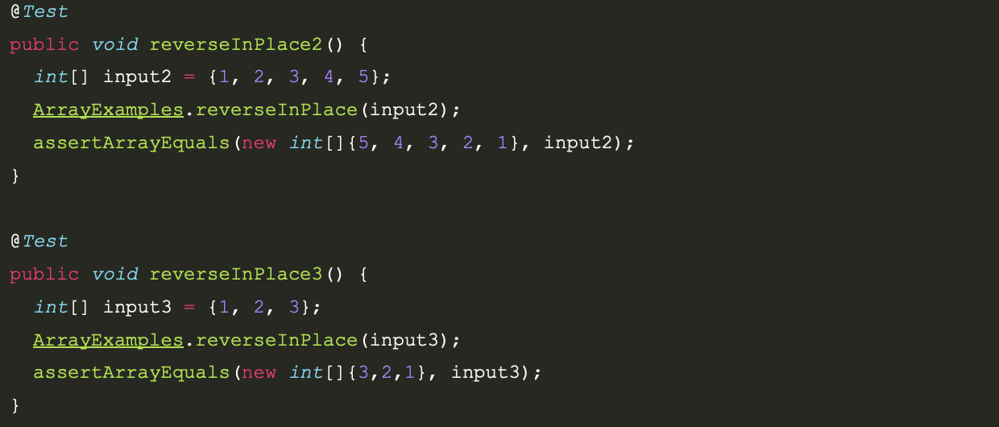

<h1>LAB REPORT 2</h1>
<h2>Part 1: StringServer</h2>
<h3>StringServer Code</h3>

```
import java.io.IOException;
import java.net.URI;

class Handler implements URLHandler {
    // The one bit of state on the server: a number that will be manipulated by
    // various requests.
    StringBuilder sbuild = new StringBuilder();

    public String handleRequest(URI url) {
        if (url.getPath().equals("/")) {
            return sbuild.toString();
        } 
        else {
            System.out.println("Path: " + url.getPath());
            if (url.getPath().contains("/add-message")) {
                String[] parameters = url.getQuery().split("=");
                if (parameters[0].equals("s")) {
                    sbuild.append(parameters[1]).append("\n");
                    return sbuild.toString();
                }
            }
            return "404 Not Found!";
        }
    }
}

    class StringServer {
    public static void main(String[] args) throws IOException {
        if(args.length == 0){
            System.out.println("Missing port number! Try any number between 1024 to 49151");
            return;
        }

        int port = Integer.parseInt(args[0]);

        Server.start(port, new Handler());
    }
}
```

<h3>Step 1 Screenshot</h3>


<h3>Step 2 Screenshot</h3>


<h2>Part 2: Lab 3 Bug</h2>




Failing Input

This code was attempting to flip the arraylist but the bug was it flipped it twice, returning the elements to the same index as before.
This problem arose because the program iterates through the entire arraylist instead of just half of the indexes and flipping the first half.
An example of a failing input would be `int[] input = {};` It would return `{}`. As expected
An example of a failing input would be `int[] input1 = {1, 2, 3};` It would return `1, 2, 3`. 


<h2>Part 3: What I Learned</h2>
During the second week of CSE15L lab, I learned something interesting relating to port access. It was not allowed for multiple users on the same computer to utilize the same port simultaneously. Ports serve as channels through which computers transmit internet and network messages when connected to a server. Thus, if multiple students were using an ieng6-201 computer, they would need to select different port numbers of their respective web servers for things to operate properly. This also happened to me when trying to call the same port in ``java StringServer 4000``   multiple times for example.

